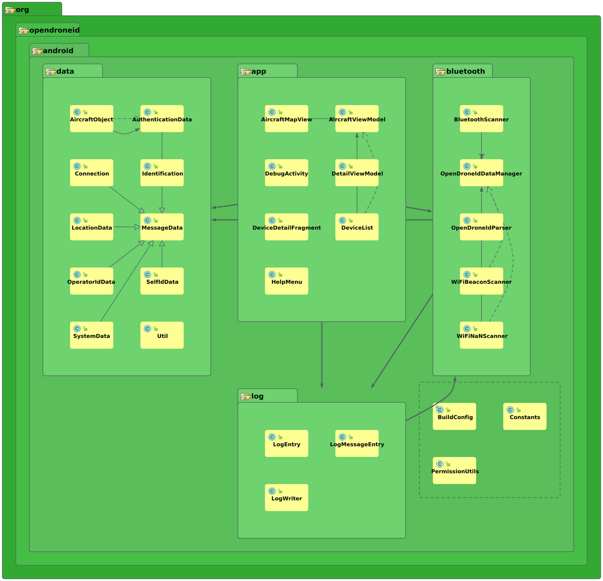

# OpenDroneID Android receiver application

This project provides the source codes for an example receiver implementation for OpenDroneID Bluetooth, WiFi NAN (Neighbor Aware Network) and WiFi Beacon signals for Android phones.
The application is compliant with the Bluetooth, WiFi NAN and WiFi Beacon parts of the ASTM F3411 Remote ID standard and the ASD-STAN prEN 4709-002 Direct Remote ID standard.

For more in-depth information about Open Drone ID, please see the opendroneid-core-c project: https://github.com/opendroneid/opendroneid-core-c

The application continuously scans for Bluetooth advertising/WiFi NAN signals/beacons.
If any is found matching the specifiers for OpenDroneID signals, it adds that transmitter to a list, will display the location of the drone on a map and can show the detailed content of the OpenDroneID data.

The red marker on the map shows the location of the drone.
The blue marker the location of the operator/take-off point (if that data field is being received).
A red line will be drawn to show where the drone has been flying.

The above screenshot shows the application when compiled to use Google Maps.
By default the application will be compiled to use Open Street Map.
In this case, the marker icons look a bit different.

Please note: The user of this receiver application must always visually verify that the received Open Drone ID signal corresponds to an actual drone seen flying in the air, at the position the signal claims it to be.

## How to build

To build the application, use Android Studio.
Import the project (File -> New -> Import Project) and point to the folder named Android.
Then Build -> Make Project.

By default the application is setup to use Open Street Map.
No maps license key is required in this case.
This mapping service is attributed to the [OpenStreetMap](https://www.openstreetmap.org/copyright) contributors.

It is possible to change the setup so that the application uses Google Maps instead.
The following code changes are needed.

* In `gradle.properties`, the line containing `org.gradle.project.map=google_map` must be uncommented
* In `activity_debug.xml`, the class reference must be changed to `AircraftMapView`
* In `main_menu.xml`, the section defining Map Type must be uncommented
* In `AircraftMapView.java`, in the function `changeMapType()`, the code must be uncommented

This variation system is far from ideal.
If anyone with better Android coding skills is able to modify the code to make it easier to swap between the two different map systems, improvements would be greatly appreciated.

For full functionality when using Google Maps, before building the source, you need to obtain a Google Maps API key.
Without the key, the application can be started and will pick up transmitted signals and will show those in the list and detailed info views, but the map view will not work.
The sources are on purpose not delivered with a Google Maps key.
Please generate your own key as detailed here:
https://developers.google.com/maps/documentation/android-sdk/get-api-key

Your own generated Google Maps key must be inserted in:
`Android/app/src/main/res/values/google_maps_api.xml`

## Transmitter Devices

If you are looking for something to test the Receiver Application against, a list of Remote ID transmitter devices is available [here](transmitter-devices.md).

## Transmission method support on different Android smartphones

An extensive list of the support in different phone models is [available here](supported-smartphones.md).

The transmission methods supported on a specific device (as per the Android feature flags) are listed in the settings menu of the application.
However, reception can still fail for various reasons.
See further details below and in the description of the [device list](supported-smartphones.md).

### Bluetooth

The Bluetooth reception of the application has been tested to work on several devices:
- Huawei Y6 Pro (Android 5.1)
- HTC one M9 (Android 5.1, 6.0, 7.0)
- OnePlus 6T (Android 9, 10 and 11)
- Samsung Galaxy S10 (Android 9, 10, 11 and 12)
- Huawei Mate 20 Pro (Android 9)
- HMD Global Nokia 2.2 (Android 9)
- Motorola One Vision (Android 9)
- Xiaomi Mi 9 (Android 9)

The app will read the Android feature flags to determine whether the phone model supports receiving only Legacy Bluetooth advertising signals (BT4) or whether it also supports receiving Long Range + Extended Advertising signals (optional BT5 features).
If both are supported, it will listen for both types simultaneously.

All tested devices receive Bluetooth Legacy advertisements continuously.

For receiving Long Range and Extended Advertising signals, out of the tested devices, only the Samsung Galaxy S10 and the Huawei Mate 20 Pro devices can be recommended.
Both receive the signals continuously.
The S10 seems to have a bit better signal strength reception.

The One Plus 6T and the Xiaomi Mi 9 both receive the signals but some power(?) saving feature or similar in the driver layer cause them to receive the signals for 5 seconds, then pause 15 seconds and this repeats.
This unfortunately makes tracking of Open Drone ID signals rather impractical due to the long pauses.
Both are based on Qualcomm Snapdragon chipsets.
A SW update somewhere in Q4 2020 changed this behavior so the One Plus 6T would listen for 1 second, pause for 4 seconds and repeat.
It might be possible that the driver layer alternate between listening to Coded PHY S=8 and S=2, causing this effect?

The Motorola One Vision and the HMD Global Nokia 2.2 are not recommended.
Both have the Android feature flags for Long Range and Extended Advertising set to true, but in reality they never receive those signals.
There seems to be a clear error in the driver implementations of those devices or maybe they don't listen to the coded PHY on the primary channel but only on the secondary channel?

The rest of the tested phones support receiving only Bluetooth Legacy Advertising signals.

### WiFi NAN

Reception of WiFi NAN signals have been successfully tested on the Samsung Galaxy S10 device.
It should be possible to receive WiFi NAN signals on the following devices, but please be aware that this has not been verified using this OpenDroneID Receiver application:
- Samsung Galaxy S9, S10, S20 (and the various +, note, ultra etc. variants of these)
- Google Pixel 2, 3, 4 (and the various A, XL variants of these)
- Xiaomi Mi 8, 9, Note 10, redmi K20 Pro/CC9 Pro/Note 10 Pro

### WiFi Beacon

WiFi Beacon reception in the current implementation is limited to devices running Android 6 and higher.
Reception has been tested on the following devices:
- Google Pixel 3 (Android 11)
- Samsung Galaxy S10 (Android 11)
- OnePlus 6T (Android 10)
- Samsung Galaxy A3 (Android 8) devices.

Please note that On Android 8 and higher, by default the scanning frequency of Wi-Fi Beacons is [throttled](https://developer.android.com/guide/topics/connectivity/wifi-scan#wifi-scan-throttling).
The only way to increase this is to enable the [Android Developer Mode](https://developer.android.com/studio/debug/dev-options) and then disable the WiFi scan throttling option.

## High level SW Architecture

An auto-generated view of the class structure can be seen in the below figure.

