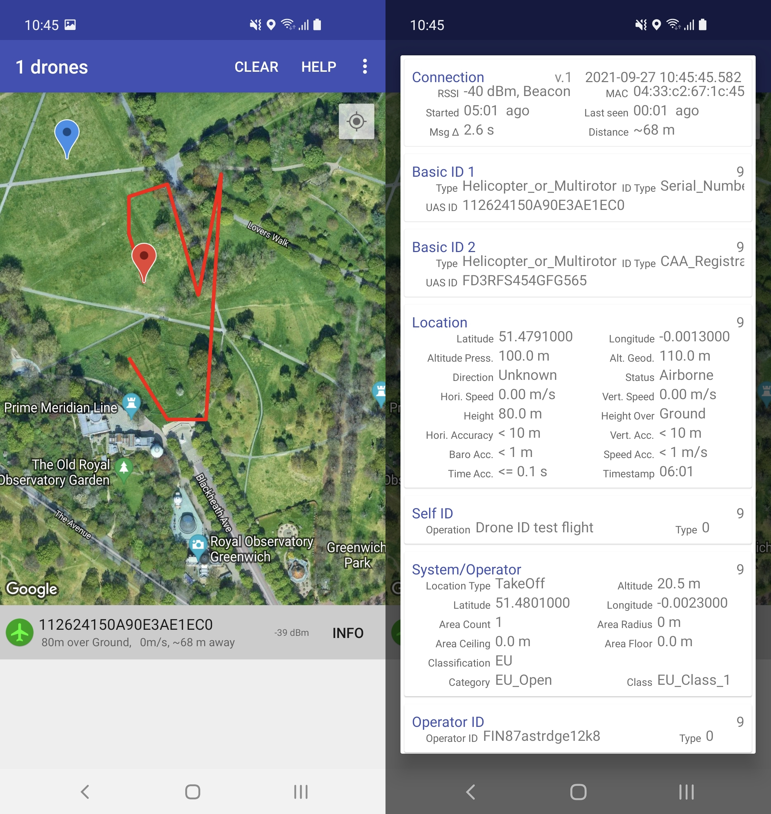

# リモートID (OpenDroneID) Android受信アプリ

このプロジェクトは、OpenDroneID Bluetooth、WiFi NAN (Neighbor Aware Network)、WiFi BeaconシグナルのAndroidスマートフォン向け受信アプリケーション実装例のソースコードを提供します。
このアプリケーションは、リモートID規格となる【ASTM F3411】Bluetooth、WiFi NAN、WiFi Beaconパーツと、DirectリモートID規格【ASD-STAN】prEN 4709-002 に準拠しています。

OpenDroneIDに関するより詳細な情報は、opendroneid-core-cプロジェクトをご覧ください:  
https://github.com/opendroneid/opendroneid-core-c  

OpenStreetMap版アプリは[Google Play](https://play.google.com/store/apps/details?id=org.opendroneid.android_osm)でご確認いただけます。

このアプリケーションは、Bluetooth advertising / WiFi NANシグナルおよびBeaconを継続的にスキャンします。
OpenDroneIDシグナル仕様に合致するものがあれば、そのリモートID送信機を一覧へ追加し、マップ上にドローンの位置を表示、OpenDroneIDデータの詳細内容を表示させることができます。

地図上の赤マーカーは、ドローンの位置を示します。青マーカーは操縦者もしくは離陸地点の位置を示します。
(そのデータフィールドを受信している場合) またドローンが飛行した場所を示す赤い線がマップ上に表示されます。

注意: この受信アプリケーションのユーザは、受信したOpenDroneIDシグナルが、信号を示している位置で空中を飛行しているドローン実機と同一であることを常に目視で確認する必要があります。

## ビルド方法

アプリケーションをビルドするには、Android Studioを使用します。プロジェクトをインポートして (File -> New -> Import Project)、【Android】フォルダを指定します。
次に、Build -> Make Projectを実行します。  

> **Note**
> 上記の説明を補足すると、ビルド -> Build Bundle(s)/APK(s) -> Build APK(s)を実行、【...\Android\app\build\intermediates\apk\debug\app-debug.apk】を出力させ、これをスマートフォンに移動しインストールを実施しました。

[**ビルドの方法に関しWikiに記載しました。ご参考としてください。(Wikiは随時更新中)**](https://github.com/ToshihiroMakuuchi/receiver-android-jp/wiki)  

完全な機能を実現するため、ソースコードをビルドする前に、Google Maps APIキーを取得する必要があります。
APIキーがない場合は、アプリケーション起動、送信された信号を取得、リストと詳細情報がビュー表示されますが、地図上に表示されるビューは動作しませんのでご注意ください。
ソースコードでは意図的にGoogle Maps APIキーは同梱提供されておらず、同一の理由で、すぐにビルド/利用可能なapkファイルも提供されてません。
こちらで説明している独自のAPIキーを生成してご利用ください。
https://developers.google.com/maps/documentation/android-sdk/get-api-key

自身で生成したAPIキーを挿入する必要があります:
`Android/app/src/main/res/values/google_maps_api.xml`

わかりやすい動画もありますので参考としてください。  
Raffaello KWOS氏: EASA REMOTE ID, come funziona e come riceverlo: OpenDroneID Android receiver application. (イタリア語)  
https://www.youtube.com/watch?v=OKslqHbcQuU

開発作業の兼ね合いで、一時的にAPKファイルを配置します。ですが完全にまっく氏のWork的なものとなりますのでご承知おきください。  
https://github.com/ToshihiroMakuuchi/receiver-android-jp/releases/

## 送信デバイス

受信アプリケーションのテスト実績として、リモートID送信デバイスの公開された動作確認済一覧は [こちら](transmitter-devices_jp.md) をご参照ください。  
※この情報は日本で販売される外付型/内蔵型リモートID送信デバイスの情報は含まれておりません。  
(メーカーの皆様、情報お待ちしておりますｗ)

## 異なるAndroidスマートフォンでの伝送方式のサポート

機種毎の対応一覧は [こちら](supported-smartphones_jp.md) を参照ください。

(Android側の機能における)特定端末でサポートされる送信方法は、アプリケーションの【設定メニュー】に記載されます。
但し、様々な理由で受信に失敗することがあります。
詳細は下記および [デバイス一覧](supported-smartphones_jp.md) の説明をご覧ください。

### Bluetooth

アプリケーションにおけるBluetooth受信は、複数のデバイスにて動作確認済みとなります:
- Huawei Y6 Pro (Android 5.1)
- HTC one M9 (Android 5.1, 6.0, 7.0)
- OnePlus 6T (Android 9, 10 and 11)
- Samsung Galaxy S10 (Android 9, 10, 11 and 12)
- Huawei Mate 20 Pro (Android 9)
- HMD Global Nokia 2.2 (Android 9)
- Motorola One Vision (Android 9)
- Xiaomi Mi 9 (Android 9)

アプリケーションはAndroid機能フラグを読み取り、スマートフォンの機種がBluetooth Legacy Advertisingシグナル (BT4) のみの受信に対応しているか、Long Range + Extended Advertisingシグナル (BT5オプション機能) の受信にも対応するかを判断します。
両方がサポートされている場合、両方のタイプを同時に読み取ります。

テストしたすべてのデバイスは、Bluetooth Legacy Advertisingシグナルを継続的に受信します。

Long Range + Extended Advertisingシグナルを受信する場合、テストしました端末のうち Samsung Galaxy S10とHuawei Mate 20 Pro だけが推奨されます。
どちらも継続的に信号を受信できています。
Samsung Galaxy S10の方が受信信号強度が良好です。

OnePlus 6TとXiaomi Mi 9はどちらも信号を受信しますが、デバイスドライバ層の何らかの省電力機能等(?)により、5秒間信号を受信後、15秒間停止…が繰り返されます。
このため、残念ながらOpenDroneID信号のトラッキングは、長い停止状態のために非現実的なものとなります。
どちらもQualcomm Snapdragonチップセットをベースにしています。
2020年第4四半期のどこかのソフトウェアアップデートでこの動作が変更され、OnePlus 6Tは1秒間受信し、4秒間停止…を繰り返すようになりました。
もしかしたら、デバイスドライバ層がCoded PHYのS=8とS=2を交互に受信し、この状態を引き起こしている可能性があるかも知れません。

Motorola One VisionとHMD Global Nokia 2.2は推奨致しません。
どちらの機種もAndroid機能フラグで Long Range + Extended Advertisingシグナルが有効として設定されますが、実際にはそれらの信号を受信はしておりません。
これらのデバイスドライバの実装に明らかな誤りがあるように思われます。あるいは、プライマリチャネルでコード化されたPHYを受信せず、セカンダリチャネルのみで受信しているかも知れません。

それ以外の機種は、Bluetooth Legacy Advertisingシグナルのみ受信に対応しています。

### WiFi NAN

Samsung Galaxy S10端末でWiFi NAN信号の受信テストに成功しました。
以下の端末でもWiFi NAN信号の受信が可能なはずですが、このOpenDroneID受信アプリケーションでの検証はしていませんのでご了承ください:
- Samsung Galaxy S9, S10, S20 (+, note, ultra等の様々なバリエーション)
- Google Pixel 2, 3, 4 (A、XL等の様々なバリエーション)
- Xiaomi Mi 8, 9, Note 10, redmi K20 Pro/CC9 Pro/Note 10 Pro

### WiFi Beacon

現在の実装では、WiFi Beaconの受信はAndroid 6以上の端末に限定されます。
以下の端末で受信を確認しています:
- Google Pixel 3 (Android 11)
- Samsung Galaxy S10 (Android 11)
- OnePlus 6T (Android 10)
- Samsung Galaxy A3 (Android 8) devices.

Android 8以降では、WiFi Beaconのスキャン頻度がデフォルトで [スロットル](https://developer.android.com/guide/topics/connectivity/wifi-scan#wifi-scan-throttling) になっていますのでご注意ください。
これを増やすには [Android Developer Mode](https://developer.android.com/studio/debug/dev-options) を有効にし、WiFiスキャンのスロットリングオプションを無効にする必要があります。

## ハイレベルなソフトウェア・アーキテクチャ

下図は自動生成されたクラス構成図です。

