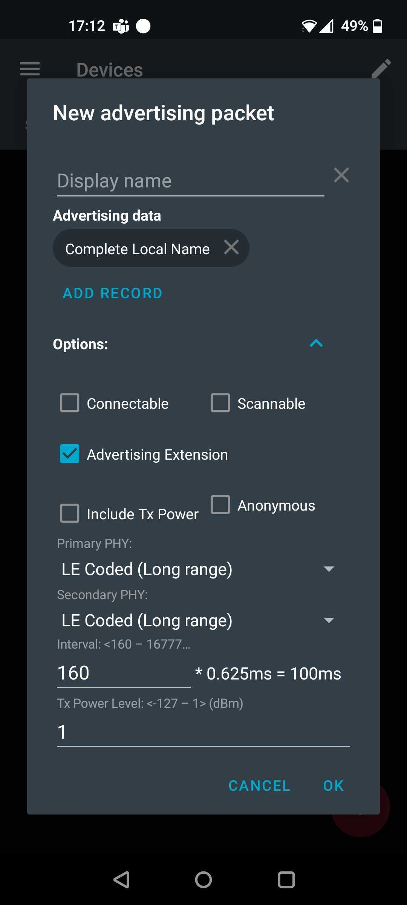
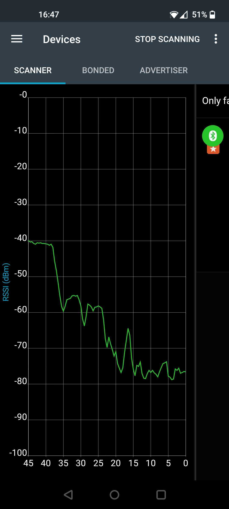

## はじめに

本資料は、欧米規格に準拠し、無人航空機 (UA) やアドオン機器からのブロードキャストリモートID信号の受信テストを実施した対応スマートフォンの一覧表です。

公開されているAndroid リモートID受信 サンプルアプリケーションのドキュメント抜粋は [こちら](https://github.com/opendroneid/receiver-android/README_jp.md) です。

リモートIDに関する一般的な情報は [こちら](https://github.com/opendroneid/opendroneid-core-c#opendroneid-core-c)をご参照ください。またリモートID送信デバイス一覧は [こちら](transmitter-devices_jp.md) に記載されています。

ASD-STAN prEN4709-02 (EU仕様) と ASTM F3411-19 (US仕様) 規格の現在の仕様は、UAから地上の観察者 (オブザーバ) に適切な識別とテレメトリーデータを伝搬するために、免許不要のスペクトル方式無線プロトコルに依存します。
特に Bluetooth 4 Legacy Advertising、Bluetooth 5 Long Range (Advertising Extensions over Coded PHY S8)、Wi-Fi Beacon、Wi-Fi Neighbor Awareness Network (NAN) 上の伝送方式が定義されています。
これらの無線技術を選択した主たる理由は、一般のスマートフォン端末でこれらのサポート要件を満たしているからとなります。

上記のいずれの規格も、ブロードキャストリモートIDの受信側を対象としてはおりません。
本資料では、コミュニティにてテストされたスマートフォンと、指定されたブロードキャストリモートID技術との互換性について、簡単に説明します。

現段階のprEN4709-02 (2021年1月時点) はCEN Enquiryでのドラフト完成版であり、最終版は今後数ヶ月のうちに発行される予定です。
ASTMリモートID規格を入手するには、こちらの [リンク](https://www.astm.org/Standards/F3411.htm) をご覧ください。

**免責事項:** テストされたデバイス一覧は完全なものではありません。また、いかなる保証も致しませんのでご了承ください。
誤記ないし誤解を招くような情報が含まれている場合がございます。
またスマートフォンメーカーのソフトウェアアップデートにより、受信能力が向上または低下するような変更が発生する場合も考えられます。
もし不完全な情報や、一貫性のない情報、誤った情報を見つけた場合は、GitHubのissue投稿を実施ください。

## テスト方法

お使いのスマートフォンがブロードキャストリモートIDメッセージを受信できるかどうかを確認するため、簡単なテスト方法を以下に説明します。
iOSはバージョン14までBluetooth 5 Long Range、Wi-Fi NANに対応しておらず、Wi-Fi Beaconの対応状況も不明なため、現在Android端末のみを対象にテストを定義しています。
Bluetooth 4 Legacy Advertisingについては、既存のAndroidおよびiOSの全機種が対応しており、予期せぬ動作をする端末が確認されていないため、テストのサポートは対象外となります。

また受信機の実装における隠れたミスをカバーする、高度なテスト手法も必要であることはご留意ください。
その一例としてBluetooth 5.0仕様のオプションであるBluetooth Long Range feature (Extended Advertisements on Coded PHY S8)が挙げられます。
Androidスマートフォンの中には、Android機能としてLong RangeとExtended Advertisingをサポートしていると謳っているものもありますが、実際にはスマートフォンから相手への広告発信 (アドバタイズ) をサポートしているだけで、リモートID情報の読み取り (スキャン) には対応していないのが現状です。
また、Bluetoothの落とし穴として知られているのは、スマートフォンがLong Rangeアドバタイズのスキャンをサポートしていても、省電力機能によってリモートIDメッセージの大部分が失われてしまうことです。
現在、高度なテスト方法に関する作業が進行中です。

### Bluetooth 5 Long Range Advertising - 端末除外基準

この簡易テストは、Long Range機能をサポートするのに十分な機能を持たないスマートフォンを簡単に除外することができるため、Bluetooth 5 Long Range機能サポートの必須条件となっています。
ただし、Long Range機能サポートを証明するために必要なすべての情報を提供するものではありません。

1. [nRF Connect for Mobile](https://play.google.com/store/apps/details?id=no.nordicsemi.android.mcp) をインストールします。
2. サイドメニューを開きデバイス情報(Device Infomation)を表示します。
3. Long Range (PHY Coded) と Extended advertisement の行が両方とも【YES】になっていることを確認してください。

デバイスがBluetooth Long Range ブロードキャストリモートID信号を受信できるようにするには、両方の行が【YES】になっている必要があります。

    

図1: OnePlus 8Tスマートフォンが端末除外基準を通過した例

### Bluetooth 5 Long Range機能サポート - データ受信機能

前回のテストで、Long Range機能サポートから外されなかったとします。
その場合、今度は対象端末の基本的な受信能力をテストする必要があります。
現時点ではOS情報から読み取ることができないため、Long Range機能に対応した別の端末を使用して確認する必要があります。

1. [nRF Connect for Mobile](https://play.google.com/store/apps/details?id=no.nordicsemi.android.mcp)を起動し、Long Range受信対応のDevice Under Test (DUT) を準備します。
  * アプリの設定メニューで【Scanner】を選択し、【Scanning period】を5分に設定します。(必要に応じて手動に設定)
2. 端末除外基準を通過した他のデバイス (Master) を使用し [nRF Connect for Mobile](https://play.google.com/store/apps/details?id=no.nordicsemi.android.mcp) を実行します。
  * または、Long Rangeアドバタイズをサポートする他のデバイス (リモートIDアドオンまたはBluetooth開発キット - 例: [nRF52840 DK](https://www.nordicsemi.com/Software-and-Tools/Development-Kits/nRF52840-DK)) を使用することもできます。
デバイスはLong Rangeメッセージのみをアドバタイズするということに注意が必要です。アドオンデバイスによってはLegacy接続が可能なメッセージもアドバタイズする場合があり、テストとして使用することはできません。
3. Masterの【Advertiser】タブで【New advertising packet】を作成します。
  * オプションで Advertising Extensions を選択し、Primary と Secondary PHY の両方で、LE Coded (Long Range) を選択します。
  * "Add Record" を押し "Complete Local Name" を選択します。
  * インターバルを 160 に設定します (結果的に100ms)
  * Tx powerを1dBm(最大)に設定します。
  * 他の項目はデフォルト値のままにしておきます。
4. Masterで、スイッチを切り替えてAdvertisementを実行します。 "No maximum options"、"Until manually turned off"を選択します。
  * 別の方法として アドオンデバイスを起動するか [Bluetooth Long Range sample](https://developer.nordicsemi.com/nRF_Connect_SDK/doc/latest/nrf/samples/bluetooth/central_hr_coded/README.html) を実行します。	
5. DUT上で、Scannerタブでスキャンを実行し、Masterデバイスの検索を試みます。
  * Masterのデバイス名が表示されます。

  * MasterがDUTの近くにある場合、一覧の他デバイスよりもかなり良いRSSIを持っているはずです。

  * 見つかったデバイスをクリックし、アドバタイズタイプが Advertising Extension であること、Primary と Secondary PHY が LE Coded であることを確認します。

  * 左側の丸いアイコンをクリックし、デバイスをお気に入りとして追加します。(丸いアイコンの下に小さな星のバナーが追加されます)
	次に、上部のフィルターをクリックし、"Only favorites" チェックボックスを選択します。

  * RSSIチャートを表示するには、デバイスを右側にスワイプします。
	複数のお気に入りデバイスが存在する場合、DUTの色に注目してください。
	チャート上で正しい色を見つけ、チャートに隙間がないか、信号が継続して受信されているかを観察してください。

  * MasterデバイスでnRF Connectを実行する以外の方法を使用している場合、そこにLegacyメッセージが表示されないことを確認してください。
その場合、Bluetooth 4でも同時に広告が表示され、RSSIチャートのギャップが表示されなくなります。
LegacyとLong Rangeのアドバタイズを同時に表示するテストは無効であり、実施すべきではありません。

  * この情報をデバイスのレポートに追加します。

    
    
    

 図2: 上記のテスト手順を説明したスクリーンショット

### Wi-Fi Beacon ブロードキャスト

今のところ、Wi-Fi Beaconメッセージを送信するドローンやアドオンデバイスを用意し、OpenDroneID受信アプリケーションでスマートフォンの受信テストを行うしか、テスト方法はないようです。

ただし、Android 6 (Marshmallow)以降を搭載したすべてのAndroid端末は、Wi-Fi Beaconの信号を受信できるものと予想されます。

Android OSはWi-Fiスキャンに様々な [スロットリング](https://developer.android.com/guide/topics/connectivity/wifi-scan#wifi-scan-throttling) 機構を施しているため、端末によって受信周波数にかなりのバラツキがあります。
[Android Developer Mode](https://developer.android.com/studio/debug/dev-options) を有効にし、WiFiスキャンのスロットリングオプションを無効にすることで、スキャン頻度を上げることができる場合があります。

### Wi-Fi NAN ブロードキャスト

サポート状況を確認する最も簡単な方法は、Android機能フラグを読むこととなります。

1. 診断アプリ [AIDA64](https://play.google.com/store/apps/details?id=com.finalwire.aida64) をインストールします。
2. Network menuを開きます。
3. 下側にスクロールし、Wi-Fi Awareのフラグを確認してください。

### リポジトリへの投稿

#### 〇 一覧に載っていないスマートフォンを持っているので、追加したいのですが…

それは素晴らしいことであります！説明している方法に従って機能を確認し、追加情報とサポート証明するテストを実施、それらのスクリーンショットを添えて プルリクエスト を作成してください。  
※こちらについては日本語版のまっく氏側では受け付けておりませんので、本家にてプルリクエストをお願いしますｗ

プルリクエストでは、スクリーンショットをリポジトリの `receiver_proofs/xxx_yyy` フォルダにアップロードしてください。 `xxx` はスマートフォンのメーカー (:Samsung)、 `yyy` はスマートフォンのモデル名 (例: `Galaxy_Note_10` )を表します。
フォルダ内のスクリーンショットには、テストした機能に応じて名前を付けてください。
以下のテンプレートを使用することをお勧め致します:

- `bt_basic.jpg` 端末除外基準を通過した結果を示します - nRF Connectのデバイス情報のスクリーンショットです。
- `bt_lr_adv.jpg` LRアドバタイズの受信状況を示します - nRF Connectスキャンのスクリーンショットです。
- `bt_lr_rssi.jpg` LRメッセージの連続受信を示します - お気に入りフィルターをオンにした nRF Connect RSSIグラフのスクリーンショットです。
- `wifi_beacon.jpg` Wi-Fi Beacon DRIメッセージの受信を示します - OpenDroneIDアプリケーションのスクリーンショットです。
- `wifi_nan.jpg` Wi-FiのNAN信号の受信能力を示します - AIDA64アプリケーションのスクリーンショットです。

次に、機能における合格または不合格のアイコンが付いたデバイスの一覧表を編集し、テストの月、年を追加し、最後に【検証】の列にフォルダへのリンクを付けます。
または、必要な情報を含むIssueを作成すれば、一覧に追加されます。

#### 〇 一覧の中に誤記の情報がありました！

まあ、そういうこともあるかもしれません。
その場合は、Issueを作成していただければ、可能な限り調査を致します。
※こちらも本家にて実施くださいｗ

#### 〇 スマートフォンのブロードキャストリモートID機能をテストする良い方法が見つかりましたか？

どんな貢献でも大歓迎です。お気軽にIssueを投稿し、さらに議論していきましょう。

### デバイスとその機能一覧

テストしたデバイスの一覧は下表をご覧ください。
各デバイスについて、機能における合格の場合は✅、不合格の場合は❌のいずれかを記載しています。
各テストには、それが起こったおおよその日付が含まれています。
デバイスは最新のOSバージョンでテストされたと仮定しています。

Wi-FiBeaconの結果についての特記事項となります。一部の端末のみ検証していますが、Android 6以降を搭載したすべての端末でWi-Fi Beaconの電波を受信できるものと思われます。
暫定的な確認として、これらの端末には➕マークを付加しています。

なお、ほとんどのスマートフォンは2020年第1四半期にテストされたものであり、動作確認が証明されたスクリーンショットは含まれていません。
そのため、その後機能が変更されている可能性があります。
今後、一覧を継続的に更新し、スクリーンショットにて証跡追加することで情報の信頼性を高めていく予定です。

| モデル名 | Chipset | Android Ver | BT5 LR 基本 | BT5 LR 受信 | Wi-Fi Beacon | Wi-Fi NAN  |  検証  | 備考 |
| -------------------- | ------------ | ------------------------- | ------------------------------- | -------------------- | ------------ | ---------- | ------ | ---- |
| Asus Zenfone 6                                   | Snapdragon 855    | 11 | ✅ 1/2021  | ✅ 7/2021  | ✅ 7/2021  | ✅ 1/2021  | [リンク](receiver_proofs/Asus_Zenfone6) | Long Rangeを連続受信できない (最大5秒間のギャップ) |
| Google Pixel 6                                   | Google Tensor     | 12 | ✅ 11/2021 | ❌ 11/2021 | ✅ 11/2021 | ✅ 11/2021 |      | Long Rangeサポートとされているが、信号は受信できない |
| Google Pixel 4/4XL                               | Snapdragon 855    | 10 |            |           |     ➕     | ✅ 1/2020  |      | |
| Google Pixel 3/3XL                               | Snapdragon 845    |  9 |            |           |     ➕     | ✅ 1/2020  |      | |
| Google Pixel 3A                                  | Snapdragon 670    | 10 | ❌ 1/2020  | ❌ 1/2020  |     ➕     | ✅ 1/2020  |      | |
| Google Pixel 2/2XL                               | Snapdragon 835    |  9 |            |            | ✅ 1/2020  | ✅ 1/2020  |      | |
| HMD Global Nokia 7.2                             | Snapdragon 660    |  9 | ❌ 1/2020  | ❌ 1/2020  |     ➕      | ❌ 1/2020  | [リンク](receiver_proofs/Nokia_7_2) | |
| HMD Global Nokia 6.2                             | Snapdragon 636    |  9 | ❌ 1/2020  | ❌ 1/2020  |     ➕      | ❌ 1/2020  | [リンク](receiver_proofs/Nokia_6_2) | |
| HMD Global Nokia 2.2                             | MT 6761 Helio A22 |  9 | ✅ 1/2020  | ❌ 1/2020  |     ➕      | ❌ 1/2020  | [リンク](receiver_proofs/Nokia_2_2) | Long Rangeサポートとされているが、信号は受信できない |
| HTC one M9                                       | Snapdragon 810    |  7 | ❌ 1/2020  | ❌ 1/2020  | ❌ 1/2020  | ❌ 1/2020  |      | |
| Honor 50 5G                                      | Snapdragon 778G   | 11 | ✅ 3/2022  | ✅ 3/2022  | ✅ 3/2022  | ❌ 3/2022  | [リンク](receiver_proofs/Honor_50_5g) | |
| Honor 50 Lite                                    | Snapdragon 662    | 11 | ❌ 3/2022  |            | ✅ 3/2022  | ❌ 3/2022  | [リンク](receiver_proofs/Honor_50_Lite) | |
| Huawei Mate 20 Pro                               | Kirin 980         |  9 | ✅ 1/2020  | ✅ 1/2020  |     ➕      | ❌ 1/2020  |      | Long Range通信を継続的に受信 |
| Huawei Mate 20                                   | Kirin 980         |    | ✅ 11/2019 | ✅ 11/2019 |     ➕      |            |      | |
| Huawei Mate 10 Pro                               | Kirin 970         |  8 |            |            | ✅ 1/2020  |            |      | |
| Huawei Mate 9                                    | Kirin 960         |  7 |            |            | ❌ 1/2020  |            |      | |
| Huawei P30 Pro                                   | Kirin 980         | 10 | ✅ 11/2019 | ✅ 11/2019 | ✅ 1/2020  |            |      | Long Range信号を継続的に受信できるか否か？不明 |
| Huawei P30                                       | Kirin 980         |    | ✅ 11/2019 | ✅ 11/2019 |     ➕      |            |      | Long Range信号を継続的に受信できるか否か？不明 |
| Huawei P20 Lite                                  | Kirin 659         |  9 | ❌ 9/2021  | ❌ 9/2021  | ✅ 1/2020  |            |      | |
| Huawei P9                                        | Kirin 955         |  6 |            |            | ❌ 1/2020  |            |      | |
| Huawei P8 Lite                                   | Kirin 655         |  7 |            |            | ❌ 1/2020  |            |      | |
| Huawei Nova 5T                                   | Kirin 980         |    | ✅ 5/2020  |            |     ➕      |            |      | |
| Huawei Nova 8i                                   | Snapdragon 662    | 10 | ❌ 03/2022 |            |     ➕      |            |  [リンク](receiver_proofs/Huawei_nova_8i) | |
| Huawei Honor Magic 2                             | Kirin 980         |    |            |            |    ➕      | ❌ 1/2020  |      | |
| Huawei Honor 10 lite                             | Kirin 710         |  9 |            |            | ✅ 1/2020  |            | [リンク](receiver_proofs/Huawei_Honor_10_Lite) | |
| Huawei Honor View 10                             | Kirin 970         |  9 |            |            | ✅ 1/2020  |            |      | |
| Huawei Honor 8S                                  | MT 6761 Helio A22 |  9 | ✅ 1/2020  |            |     ➕      | ❌ 1/2020  | [リンク](receiver_proofs/Huawei_Honor_8S) | 未検証となるが、Nokia 2.2と同一な動作が期待できる |
| Huawei Y6 Pro                                    | MT 6761 Helio A22 |  5 | ❌ 1/2020  | ❌ 1/2020   |            | ❌ 1/2020  |      | |
| Huawei MediaPad M5                               | Kirin 960s        |  9 | ❌ 1/2021  | ❌ 1/2021   | ✅ 1/2020   | ❌ 1/2021  | [リンク](receiver_proofs/Huawei_MediaPad_M5) | |
| Huawei Nexus 6P                                  | Snapdragon 810    |  8 |            |            | ✅ 1/2020  |            | [リンク](receiver_proofs/Huawei_Nexus_6P) | |
| LG velvet 5G                                     | Snapdragon 765G   |    |            |            |     ➕     | ✅ 1/2021  |      | |
| LG G8X                                           | Snapdragon 855    |    |            |            |     ➕     | ✅ 1/2021  |      | |
| LG G5                                            | Snapdragon 820    |  8 | ❌ 1/2021  | ❌ 1/2021   | ✅ 1/2020  | ❌ 1/2021  | [リンク](receiver_proofs/LG_G5) | |
| LG V60                                           | Snapdragon 865    | 10 |            |            |     ➕     | ✅ 1/2020  |      | |
| LG Nexus 5X                                      | Snapdragon 808    |  8 |            |            | ✅ 1/2020  |            |      | |
| LG X Cam                                         | MT 6735           |  6 |            |            | ❌ 1/2020  |            |      | |
| Motorola Edge 20 Pro                             | Snapdragon 870 5G | 11 | ✅ 3/2022  | ❌ 3/2022  |      ➕     |           | [リンク](receiver_proofs/Motorola_Edge_20_Pro) | Long Rangeサポートを謳うが、信号は受信できていない。Texas Instrument社製LAUNCHXL-CC1352P-2を使用してのテストを実施 |
| Motorola One Vision                              | Exynos 9609       |  9 | ✅ 1/2020  | ❌ 1/2020  |      ➕     | ❌ 1/2020  | [リンク](receiver_proofs/Motorola_One_Vision) | Long Rangeサポートとされているが、信号は受信できない |
| Motorola Moto G 6 plus                           | Snapdragon 630    |  9 | ❌ 1/2020  | ❌ 1/2020  |      ➕     | ❌ 1/2020  |      | |
| Nokia 9 Pureview                                 | Snapdragon 845    |  9 |            |            | ✅ 1/2020  |            |      | |
| Nokia X20                                        | Snapdragon 480    | 12 | ✅ 3/2022  | ✅ 3/2022  | ✅ 3/2022  | ✅ 3/2022  | [リンク](receiver_proofs/Nokia_X20) | Long Range受信は部分的に成功しているが長めのギャップあり(15秒) |
| OnePlus 8T                                       | Snapdragon 865    | 11 | ✅ 1/2021  | ✅ 1/2021  |      ➕     | ❌ 1/2021  | [リンク](receiver_proofs/OnePlus_8T) | Long Range受信は一部のみ有効 |
| One Plus 7 Pro                                   | Snapdragon 855    | 10 | ✅ 1/2020  |            |     ➕      | ❌ 1/2020  | [リンク](receiver_proofs/OnePlus_7_Pro) | おそらくOne Plus6Tや8Tと同様のLong Range受信動作と想定 (未確認) |
| One Plus 7T                                      | Snapdragon 855+   | 10 | ✅ 1/2020  |            |     ➕      | ❌ 1/2020  | [リンク](receiver_proofs/OnePlus_7T) | おそらくOne Plus6Tや8Tと同様のLong Range受信動作と想定 (未確認) |
| One Plus 6 / 6T                                  | Snapdragon 845    | 10 | ✅ 1/2021  | ✅ 1/2021  | ✅ 1/2020  | ❌ 1/2021  | [リンク](receiver_proofs/OnePlus_6), [リンク](receiver_proofs/OnePlus_6T) | Long Range受信は一部のみ有効 |
| One Plus Nord 5G                                 | Snapdragon 765G   | 10 | ✅ 1/2021  | ✅ 1/2021  |      ➕     | ❌ 1/2021  | [リンク](receiver_proofs/OnePlus_Nord_5G) | Long Range通信を継続的に受信 |
| One Plus N10 5G                                  | Snapdragon 690    | 10 | ✅ 1/2021  | ✅ 1/2021  |      ➕     | ❌ 1/2021  | [リンク](receiver_proofs/OnePlus_N10_5G) | Long Range通信を継続的に受信 |
| Razer phone 2                                    | Snapdragon 845    |    |            |            |     ➕      |            |      | |
| Realme GT Master Edition                         | Snapdragon 778G   | 11 | ✅ 3/2022  | ✅ 3/2022  | ✅ 3/2022   | ❌ 3/2022  | [リンク](receiver_proofs/Realme_GT_Master_Edition) | |
| Samsung Galaxy Note 10, Note 10+                 | Exynos 9825       |  9 |            |            | ✅ 4/2021 | ✅ 1/2020  | [リンク](receiver_proofs/Samsung_Galaxy_Note_10), [リンク](receiver_proofs/Samsung_Galaxy_Note_10+) | |
| Samsung Galaxy Note 9 (Global)                   | Exynos 9810       |    |            |            |     ➕      |            |      | |
| Samsung Galaxy Note 9 (USA, China, Japan)        | Snapdragon 845    |    |            |            |     ➕      |            |      | |
| Samsung Galaxy Note 8 (Global)                   | Exynos 8895       |  9 |            |            | ✅ 1/2020  |            |      | |
| Samsung Galaxy Note 8 (USA, China, Japan)        | Snapdragon 835    |    |            |            |     ➕      |            |      | |
| Samsung S22+                                     | Exynos 2200       | 12 | ✅ 03/2022 | ✅ 03/2022 | ✅ 03/2022 | ✅ 03/2022 | [リンク](receiver_proofs/Samsung_Galaxy_S22+) | Long Range通信を継続的に受信 |
| Samsung S21, S21+, S21 Ultra                     | Exynos 2100       | 11 | ✅ 11/2021 | ✅ 11/2021 | ✅ 11/2021 | ✅ 11/2021 |      | Long Range通信を継続的に受信 |
| Samsung S20, S20+, S20 ultra (Global)            | Exynos 990        | 10 | ✅ 1/2021  | ✅ 1/2021  | ✅ 1/2020  | ✅ 1/2020  | [リンク](receiver_proofs/Samsung_Galaxy_S20_Exynos) | |
| Samsung S20, S20+, S20 ultra (USA, China, Japan) | Snapdragon 865    | 10 | ✅ 2/2021  | ✅ 2/2021  |      ➕     | ✅ 2/2021  |      | Long Range通信を継続的に受信 |
| Samsung Galaxy S10, S10e, S10+, S10 5G           | Exynos 9820       | 10 | ✅ 1/2021  | ✅ 1/2021  | ✅ 1/2020  | ✅ 1/2020  | [リンク](receiver_proofs/Samsung_Galaxy_S10_Exynos) | Long Range通信を継続的に受信 |
| Samsung Galaxy S9, S9+ (Global)                  | Exynos 9810       |  9 | ❌ 1/2020  | ❌ 1/2020  | ✅ 1/2020  | ✅ 1/2020  |      | |
| Samsung Galaxy S8                                | Exynos 8895       |  9 |            |            | ✅ 1/2020  |            |      | |
| Samsung Galaxy S7                                | Exynos 8890       |    |            |            | ✅ 4/2021  |            | [リンク](receiver_proofs/Samsung_Galaxy_S7) | |
| Samsung Galaxy S6                                | Exynos 7420       |    |            |            | ✅ 4/2021  |            | [リンク](receiver_proofs/Samsung_Galaxy_S6) | |
| Samsung Galaxy A5                                | Snapdragon 410    |    |            |            | ✅ 1/2020  |            |      | |
| Samsung Galaxy A71                               | Snapdragon 730    | 10 | ❌ 1/2021  | ❌ 1/2021   | ✅ 9/2021  | ✅ 1/2021  | [リンク](receiver_proofs/Samsung_Galaxy_A71) | |
| Samsung Galaxy A8                                | Exynos 7885       |    |            |            | ✅ 4/2021  |            | [リンク](receiver_proofs/Samsung_Galaxy_A8) | |
| Samsung Galaxy Xcover Pro                        | Exynos 9611       | 10 | ❌ 1/2020  | ❌ 1/2020   |      ➕     | ❌ 1/2020  | [リンク](receiver_proofs/Samsung_Galaxy_XCover_Pro) | |
| Samsung Galaxy Xcover 5                          | Exynos 850        | 11 | ✅ 03/2022 | ❌ 03/2022 | ✅ 03/2022  | ❌ 03/2022 | [リンク](receiver_proofs/Samsung_Galaxy_XCover_5) | |
| Samsung Galaxy M12                               | Exynos 850        | 11 | ✅ 03/2022 | ❌ 03/2022 | ✅ 03/2022  | ❌ 03/2022 | [リンク](receiver_proofs/Samsung_Galaxy_m12) | |
| Samsung Galaxy A52s                              | Snapdragon 778G   | 11 | ✅ 03/2022 | ✅ 03/2022 | ✅ 03/2022  | ✅ 03/2022 | [リンク](receiver_proofs/Samsung_Galaxy_A52s)| |
| Samsung Galaxy Xcover Pro                        | Snapdragon 865    | 10 |            |            |     ➕      | ✅ 1/2020  |      | |
| Samsung Galaxy Tab S7, S7+                       | Snapdragon 865+   |    |            |            |     ➕      | ✅ 1/2021  |      | |
| Samsung Galaxy Tab S6                            | Snapdragon 855    |    | ✅ 6/2020   |            |     ➕      |            |      | |
| Samsung Galaxy A3                                | Exynos 7870       |    | ❌ 1/2021   | ❌ 1/2021   |     ➕      | ❌ 1/2021  |      | |
| Sony XQ-AD52 Xperia L4                           | MT6762 Helio P22  |    | ✅ 1/2021   | ❌ 1/2021   |     ➕      | ❌ 1/2020  |      | |
| Sony Xperia 10 III                               | Snapdragon 690    | 11 | ❌ 3/2022   |            | ✅ 3/2022  |              | [リンク](receiver_proofs/Sony_Xperia_10_III) | |
| Sony Xperia 5 III                                | Snapdragon 888    | 12 | ❌ 3/2022   |            | ✅ 3/2022  |              | [リンク](receiver_proofs/Sony_Xperia_5_III) | |
| Sony Xperia 5                                    | Snapdragon 855    |    |            |             | ✅ 4/2021  |             | [リンク](receiver_proofs/Sony_Xperia_5) | |
| Sony Xperia XA2                                  | Snapdragon 630    |  9 | ❌ 1/2020   | ❌ 1/2020   |     ➕     | ❌ 1/2020  |      | |
| Sony Xperia XZ1 Compact                          | Snapdragon 835    |  8 |            |            | ✅ 1/2020  |            |      | |
| Sony Xperia XZ2                                  | Snapdragon 845    | 10 |            |            | ✅ 1/2020  |            |      | |
| Vivo V21                                         | Dimensity 800U    | 11 | ✅ 3/2022  | ❌  3/2022 | ✅ 3/2022  | ❌ 3/2022  | [リンク](receiver_proofs/Vivo_V21) | |
| Xiaomi Note 10                                   | Snapdragon 730G   |  9 | ✅ 1/2020  |            |      ➕     | ✅ 1/2020  | [リンク](receiver_proofs/Xiaomi_Mi_Note_10) | |
| Xiaomi Mi 9T Pro                                 | Snapdragon 855    |  9 | ✅ 1/2020  |            |      ➕     | ✅ 1/2020  | [リンク](receiver_proofs/Xiaomi_Mi_9T_Pro) | |
| Xiaomi Mi 9 SE                                   | Snapdragon 712    |  9 | ✅ 1/2020  |            |      ➕     | ❌ 1/2020  | [リンク](receiver_proofs/Xiaomi_Mi_9_SE) | |
| Xiaomi Mi 9                                      | Snapdragon 855    |  9 | ✅ 1/2020  | ✅ 1/2020   |      ➕     | ✅ 1/2020  | [リンク](receiver_proofs/Xiaomi_Mi_9) | Long Range受信は一部のみ有効 |
| Xiaomi Mi 8                                      | Snapdragon 845    |  9 |            |            |     ➕      | ✅ 1/2020  |      | |
| Xiaomi Redmi Note 9s                             | Snapdragon 720G   |    | ✅ 6/2020  |            |      ➕     |            |      | |
| Xiaomi Redmi note 8 Pro                          | MT Helio G90T     |  9 | ✅ 1/2020  |            |      ➕     | ❌ 1/2020  | [リンク](receiver_proofs/Xiaomi_Redmi_Note_8_Pro) |  |
| Xiaomi Redmi note 7 Pro                          | Snapdragon 675    |    |            |            |     ➕      |            |      | |
| Xiaomi Redmi note 8T                             | Snapdragon 665    |  9 | ❌ 1/2020  | ❌ 1/2020   |      ➕     | ❌ 1/2020  | [リンク](receiver_proofs/Xiaomi_Redmi_Note_8T) | |
| Xiaomi Redmi note 7                              | Snapdragon 660    |  9 | ❌ 1/2020  | ❌ 1/2020   |      ➕     | ❌ 1/2020  | [リンク](receiver_proofs/Xiaomi_Redmi_Note_7) | |
| Xiaomi Redmi CC9 Pro/Note10 Pro                  | Snapdragon 730G   | 10 |            |            |     ➕      | ✅ 1/2020  |      | |
| Xiaomi Redmi K20 Pro                             | Snapdragon 855    |  9 |            |            |     ➕      | ✅ 1/2020  |      | |
| Xiaomi Mi Mix 3                                  | Snapdragon 845    |  9 |            |            | ✅ 1/2020  | ✅ 1/2020  |      | |
| Xiaomi Mi A2                                     | Snapdragon 660    |  9 | ❌ 1/2020  | ❌ 1/2020   |       ➕    | ❌ 1/2020  | [リンク](receiver_proofs/Xiaomi_Mi_A2) | |
